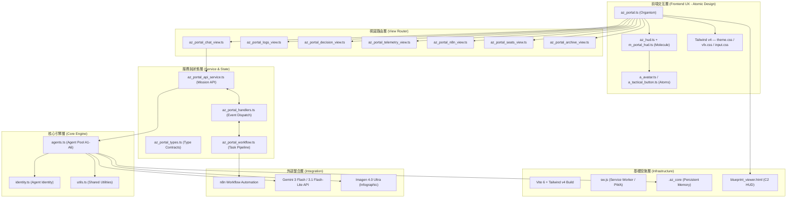
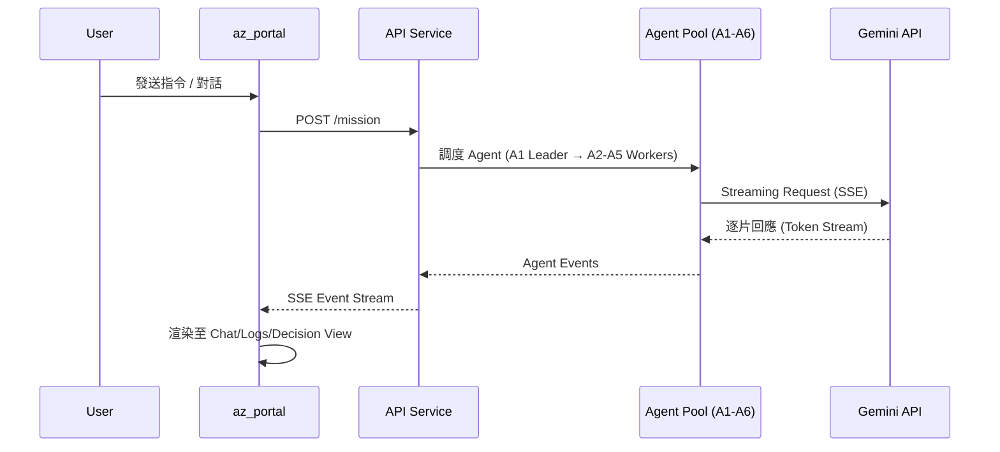

# Astra Zenith Streaming 架構藍圖 (Architecture Blueprint)

> 參考 OpenHarness 工業級代理執行內核設計，結合本專案特性的架構設計與建議

---

## 📌 1. 系統層次化視覺概覽 (Architecture Layers)



---

## 🎨 2. 原子化設計分層 (Atomic Design Mapping)

本專案採用 **Atomic Design** 架構，將 UI 組件從最小粒度逐步組合：

| 層級 | 目錄 | 職責 | 範例 |
|:---|:---|:---|:---|
| **Atoms** | `src/scripts/atoms/` | 最小可複用 UI 元件 | `a_avatar.ts`, `a_tactical_button.ts`, `brackets.ts` |
| **Molecules** | `src/scripts/molecules/` | 組合原子的功能單元 | `m_agent_unit.ts`, `m_portal_hud.ts`, `m_portal_content_header.ts` |
| **Organisms** | `src/scripts/organisms/` | 完整業務功能區塊 | `az_portal.ts`, `az_header.ts`, `az_hud.ts`, `az_portal_chat_view.ts` |
| **Core** | `src/scripts/core/` | 業務邏輯引擎 | `agents.ts`, `identity.ts`, `utils.ts` |
| **Integrations** | `src/scripts/integrations/` | 外部系統橋接 | `n8n/` (Workflow Automation) |

### CSS 分層 (Tailwind v4 Single-Origin)

| 層 | 檔案 | 用途 |
|:---|:---|:---|
| `@layer base` | `input.css` | 全局重置 |
| `@layer theme` | `theme.css` | 設計 Token、色彩變數、極光背景 |
| `@layer components` | `atoms.css`, `molecules.css`, `organisms.css`, `portal_components.css` | 組件樣式 |
| `@layer utilities` | `overrides.css` | 原子級覆蓋工具 |
| `@layer vfx` | `vfx.css` | 視覺特效 (掃描線、光波、粒子) |

---

## 🚀 3. 核心交互流程 (Core Flow)

### 3.1 任務執行管線 (Mission Pipeline)



### 3.2 多代理協作模型 (Multi-Agent Orchestration)

```
┌─────────────────────────────────────────────┐
│              A1: Leader (Gemini 3 Flash)     │
│  ┌──────┐ ┌──────┐ ┌──────┐ ┌──────┐       │
│  │A2    │ │A3    │ │A4    │ │A5    │       │
│  │Analyz│ │Codege│ │Refine│ │Evalua│       │
│  │er    │ │n     │ │r     │ │tor   │       │
│  │(Lite)│ │(Lite)│ │(Lite)│ │(Lite)│       │
│  └──┬───┘ └──┬───┘ └──┬───┘ └──┬───┘       │
│     └────────┴────────┴────────┘            │
│              ↓ 彙整結果                      │
│     A6: System Orchestrator (Gemini 3 Flash) │
│              ↓ 視覺需求                      │
│     Imagen 4.0 Ultra → 戰略圖表             │
└─────────────────────────────────────────────┘
```

---

## 🏗️ 4. 參考 OpenHarness 的架構建議 (OH-Inspired Recommendations)

### 4.1 中間件管線化 (Middleware Pipeline)

**現狀**：處理邏輯分散在 `az_portal_handlers.ts` 各個函式中。

**建議**：引入類似 OH 的中間件設計：

```typescript
// 建議新增: src/scripts/core/middleware.ts
type Middleware = (ctx: AgentContext, next: () => Promise<void>) => Promise<void>;

const withRetry: Middleware = async (ctx, next) => {
  // 指數退避 + 隨機抖動，應對 Gemini API 429/503
};

const withTokenGuard: Middleware = async (ctx, next) => {
  // 預測性 Token 壓縮 — Phase 1: 剪枝 → Phase 2: 摘要
};

const withTurnTracking: Middleware = async (ctx, next) => {
  // 限制對話輪次，防止無限迴圈
};

const withAuditLog: Middleware = async (ctx, next) => {
  // 全鏈路追蹤，寫入 .az_core
};
```

### 4.2 兩階段上下文壓縮 (Two-Phase Compaction)

**優先級：高** — 解決長對話 Token 溢出問題：

1. **Phase 1 (Pruning)**：當 Token 接近限額，優先將早期工具輸出標記為 `[pruned]`
2. **Phase 2 (Summarization)**：剪枝無效時，調用輕量模型生成摘要

### 4.3 路徑追蹤協議 (Path Tracing)

**建議**：為每個 Agent Event 加入 `path: string[]` 屬性：
```typescript
interface AZAgentEvent {
  path: string[];       // e.g., ["A1:Leader", "A3:Codegen"]
  type: 'text' | 'tool-call' | 'reasoning' | 'status';
  payload: unknown;
  timestamp: number;
}
```

### 4.4 VFS 虛擬檔案系統沙箱

**建議**：引入 `FsProvider` 抽象層，限制 Agent 讀寫範圍至 `/workspace`，防止路徑遍歷攻擊。

### 4.5 Lazy Skills 動態載入

**現狀**：`AGENT_POOL` 靜態載入。

**建議**：將 A1-A6 的專業知識（Modbus 協議、異常碼對照表）存為 `SKILL.md`，僅在需要時動態注入，節省 60%+ Token 消耗。

---

## 🛡️ 5. 安全邊界與防護 (Security Boundaries)

| 層級 | 機制 | 說明 |
|:---|:---|:---|
| **傳輸層** | HTTPS + Brotli | 加密傳輸 + 壓縮 |
| **驗證層** | Zod Schema | 所有入站 Payload 嚴格校驗 |
| **頻率限制** | Circuit Breaker | Gemini API RPM/TPM 熔斷 |
| **工具操作** | Binary Whitelist | 防止 Agent 讀取二進位檔案 |
| **輸出截斷** | 50KB Cap | 大型工具輸出自動截斷 |
| **審核互斥** | Prompt Mutex | 多 Agent 並發確認自動隊列化 |
| **記憶隔離** | .az_core | 持久化記憶隔離於 Session |

---

## 📁 6. 專案目錄結構 (Project Structure)

```
Astra Zenith Streaming/
├── .az_core/                     # 持久化記憶與狀態
│   ├── AGENT_STATE.json
│   └── MEMORY.md
├── docs/                         # 架構與規格文件
│   ├── ASTRA_ZENITH_ARCH_BLUEPRINT.md  ← 本文件
│   ├── MODELS_SPEC.md
│   ├── architecture_design_guidelines.md
│   ├── archive/                  # 歸檔文件
│   └── design_specs/             # UI 規格
├── public/
│   ├── blueprints/
│   └── images/
├── src/
│   ├── core/                     # (預留) 核心型別
│   ├── scripts/
│   │   ├── atoms/                # Atomic UI 元件
│   │   ├── molecules/            # 組合功能單元
│   │   ├── organisms/            # 完整業務區塊
│   │   ├── core/                 # 業務邏輯引擎
│   │   └── integrations/         # 外部系統橋接
│   └── styles/
│       ├── input.css             # Tailwind 入口
│       ├── theme.css             # 設計 Token
│       ├── atoms.css             # 原子樣式
│       ├── molecules.css
│       ├── organisms.css
│       └── vfx.css               # 視覺特效
├── blueprint_viewer.html         # C2 觀測站
├── sw.js                         # Service Worker
├── manifest.webmanifest          # PWA 設定
├── vite.config.ts                # Vite 6 建置
└── package.json
```

---

## 🚦 7. 實施藍圖 (Implementation Roadmap)

### Phase I: 中間件核心化
- 建立 `middleware.ts` 核心管線
- 導入 `withRetry` + `withTokenGuard`
- 重構 `az_portal_handlers.ts` 為管線式架構

### Phase II: 協議升級
- 為 Agent Event 加入 `path` 與 `data-oh:` 協議
- 前端實作路徑追蹤渲染
- 導入 Reasoning 摺疊 UI

### Phase III: 工業級加固
- VFS 沙箱隔離
- Binary Guardrail (Worker 層)
- MCP Gateway 延遲連接
- 全鏈路 AbortSignal 支持

### Phase IV: 智慧優化
- 兩階段預測性壓縮
- Lazy Skills 動態載入
- Context Caching (Gemini TTL)
- 全鏈路分鏡追蹤 (OpenTelemetry)

---

> [!IMPORTANT]
> **本架構的核心精神**：結合 Atomic Design 的 UI 可組合性與 OpenHarness 的工業級執行管控，
> 打造一個「視覺保真 + 運行穩健 + 安全可控」的 AI Multi-Agent 串流平台。

---
*文件版本: v1.0 | 建立日期: 2026-04-07 | 參考: OpenHarness SDK Architecture*
