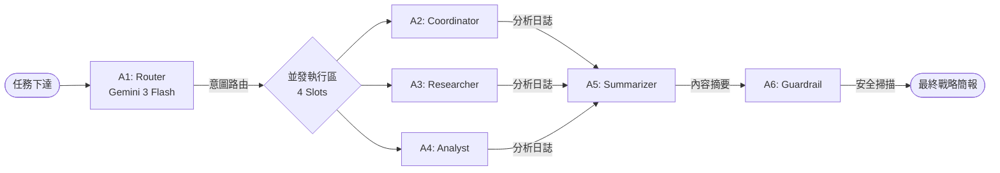

# 🌌 Astra Zenith 模型架構與編排說明 (Model Orchestration Spec)

本文檔詳細說明 Astra Zenith Portal 在 2026 年採組的 **「Multi-Agent Strategic Coordination (MASC)」** 指揮架構。

---

## 🏗️ 核心模型資產庫 (Model Assets - 2026 Unified SDK)

本系統已完全遷移至 **@google/genai (v1.x)** Unified SDK，並針對 2026 年最新模型艦隊進行了最佳化配置。

### 🛰️ 代理人艦隊分配 (Primary Agent Fleet)

| ID | 角色 | 模型 (Free Tier) | 模型 (Paid Tier) | 核心職能 |
|:---|:---|:---|:---|:---|
| **A1** | Router | gemini-3-flash-preview | gemini-3-flash-preview | 意圖路由、任務分發、SDD 規格生成 |
| **A2** | Coordinator | gemini-3.1-flash-lite-preview | gemini-3.1-pro-preview | 代理人同步、衝突調解、進度管理 |
| **A3** | Researcher | gemini-2.5-flash-lite | gemini-3.1-flash-lite-preview | 地面檢索 (Google Search)、事實查核 |
| **A4** | Analyst | gemini-3.1-flash-lite-preview | gemini-3.1-pro-preview | 深度推論、邏輯合成、技術分析 |
| **A5** | Summarizer | gemini-2.5-flash-lite | gemini-3.1-flash-lite-preview | 上下文壓縮、戰略簡報、報告生成 |
| **A6** | Guardrail | gemini-3-flash-preview | gemini-3-flash-preview | 輸出驗證、安全過濾、工業級合規檢查 |

### 🧬 技術標準 (Unified SDK Standards)

1.  **統一通訊協議**：
    *   **SDK**: `@google/genai` (v1.x Unified SDK)。
    *   **API 版本**: `v1beta` (支持最新多模態與 Grounding 功能)。
    *   **併發控制**: 透過 `externalApiGate` 實作 4 個並行執行槽。

2.  **上下文優化 (Gemini Cookbook 模式)**：
    *   **Context Caching**: 針對大規模任務規格進行跨回合持久化緩存 (`cachedContent`)。
    *   **Multimodal RAG**: `VectorService` 支持存儲與檢索 `fileData` (圖片/PDF)，Agent 可直接感知多模態資源。
    *   **File API**: 資源透過 `client.files.upload` 上傳，通訊時引用 `fileUri` 以節省頻寬。

3.  **Grounding & 智慧工具**：
    *   **A3 (Researcher)**: 預設掛載 `googleSearchRetrieval` 工具，具備實時互聯網檢索能力。
    *   **Structured Output**: 核心決策 (A1, A6) 採用 `responseMimeType: 'application/json'` 確保邏輯穩定性。

3.  **韌性與備援機制**：
    *   **一級備援**: `gemini-3.1-flash-lite-preview` (穩定 Worker)。
    *   **高階備援**: `gemini-3.1-pro-preview` (付費層級推理)。
    *   **開放模型備援**: `gemma-4-it` (適用於高頻次輕量化任務)。

---

## 🔄 戰略編排邏輯 (Orchestration Flow)

---

## 📊 效能指標 (Telemetry Targets)

*   **目標 TTFT (首字時間)**: < 2.5s (得益於 Unified SDK 與並發優化)。
*   **Token 壓縮率**: 透過對話剪裁與 Caching 達成 75% 以上節省。
*   **併發上限**: Free Tier 15 RPM / Paid Tier 2000 RPM。

---
*Last Updated: 2026-04-11 | Astra Zenith Strategic Matrix (v2.0)*
