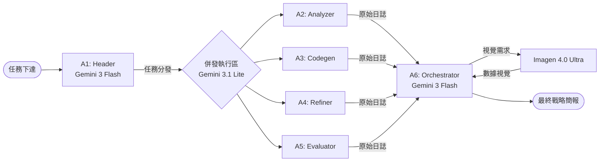

# 🌌 Astra Zenith 模型架構與編排說明 (Model Orchestration Spec)

本文檔詳細說明 Astra Zenith Portal 在 2026 年採組的 **「混合三模 (Mixed-Tri-Model)」** 指揮架構。

---

## 🏗️ 核心模型資產庫 (Model Assets - 2026 Q2 Free Tier)

於 2026-04-01 後，Google 已正式將所有 **Pro** 模型轉入付費牆。本系統已全面過渡至最新的 **Flash** 與 **Flash-Lite** 指令系列，以維持 100% 免費層級運作。

### 1. ⚡ Gemini 3 Flash (Preview)
*   **用途**：高端語義理解、戰略拆解、任務總結。
*   **特性**：2026 最強免費旗艦，具備原生多模態及 1M Token 上下文。
*   **模型 ID**：`gemini-3-flash-preview`
*   **頻率限制 (Free Tier)**：
    *   **RPM**: 15 (每分鐘要求數)
    *   **RPD**: 1,500 (每日要求數)
*   **分配代理**：A1 (Leader), A6 (System_Orchestrator)

### 2. 🛡️ Gemini 3.1 Flash-Lite (Preview)
*   **用途**：高吞吐量數據處理、分析、代碼編核。
*   **特性**：專為併發環境優化，延遲極低。
*   **模型 ID**：`gemini-3.1-flash-lite-preview`
*   **頻率限制 (Free Tier)**：
    *   **RPM**: 15 (每分鐘要求數)
    *   **RPD**: 1,500 (每日要求數)
*   **分配代理**：A2 (Analyzer), A3 (Codegen), A4 (Refiner), A5 (Evaluator)

### 3. 🔥 Gemma 4 26B (MoE)
*   **用途**：特定環境探測、本機端推理、高配額備援。
*   **特性**：具備更高的高頻率容忍度 (30 RPM)。
*   **分配代理**：可用於大規模任務時自動切換備援。

### 4. 🎨 Imagen 4.0 Ultra
*   **用途**：Infographic 戰略圖表生成。
*   **模型 ID**：`imagen-4.0-ultra-generate-001`
*   **限制**：25 RPD。

---

## 🔄 戰略編排邏輯 (Orchestration Flow)

---

## ⚠️ 關鍵配置提醒

*   **API 協議**：系統必須使用 `v1beta` 版本以支持圖形合成指令。
*   **配額保護**：在 Free Tier 下，併發代理建議維持在 3 個以內，以避免觸發 429 速率限制。
*   **安全性**：所有模型均受 `v1beta` 安全過濾器保護，符合工業級合規標準。

---
*Last Updated: 2026-04-04 | Astra Zenith Strategic Matrix*
